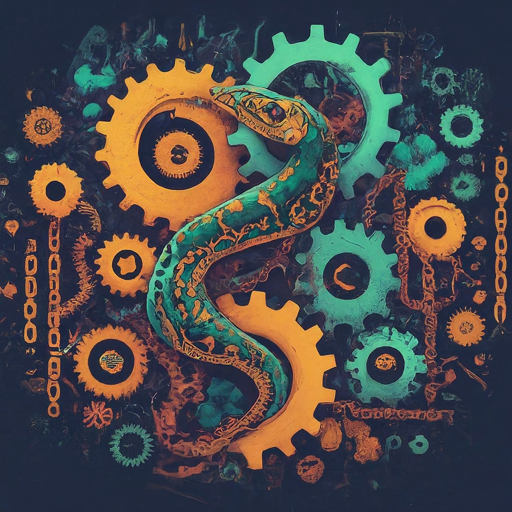

<div align="center">
  <h1>
    <br/>
    
    <br/>
    LangChain Utility
  </h1>
</div>

<p align="center">
  <a href="https://www.python.org/downloads/release/python-3114/">
    
  </a>
  <a href="https://python-poetry.org/">
    
  </a>
  <a href="https://github.com/langchain-ai/langchain">
    
  </a>
  <a href="https://github.com/streamlit/streamlit">
    
  </a>
</p>

- [Description](#description)
- [Development](#development)
  - [Requirements](#requirements)
  - [How to prepare the environment](#how-to-prepare-the-environment) 
- [Disclaimer](#disclaimer)

## Description <a name="description"></a>
[LangChain](https://www.langchain.com/langchain) is a framework for developing applications powered by language models. 
It enables application that:
* **Are context aware**; i.e. connect a language model to sources context
* **Reason**; i.e. rely on a language model to reason

This library extends LangChain by providing facilities to define configurations, templates for execution of LLMs.

## Development <a name="development"></a>

### Requirements <a name="requirements"></a>
* Git
* LangChain >= 0.1.7
* Python >= 3.11
* Poetry >= 1.7.0
* Streamlit >= 1.31.1


### How to prepare the environment <a name="how-to-prepare-the-environment"></a>
* Install dependencies
  ```
  poetry install
  ```
  ---
  **NOTE**
  To update dependencies, it may be needed to run the following command prior to installing the packages:
  ```
  poetry lock
  ```
  ---
* Test unit test coverage for the project
  ```
  poetry run coverage run -m pytest && poetry run coverage report -m
  ```
  **Note** Report is only generated if all unit test have completed successfully.

## Disclaimer <a name="disclaimer"></a>
This library and its use of Large Language Models (LLMs) are subject to the **following disclaimers**:
* LLMs are still under development and may generate inaccurate, incomplete, or biased output;
* LLMs can inherit and reflect biases present in their training data;
* Developers of this library are not liable for any damages or losses arising from its use;
* You are responsible for using the library and LLMs in an ethical and responsible manner.

**By using this library, you acknowledge and agree to these disclaimers and limitations**.