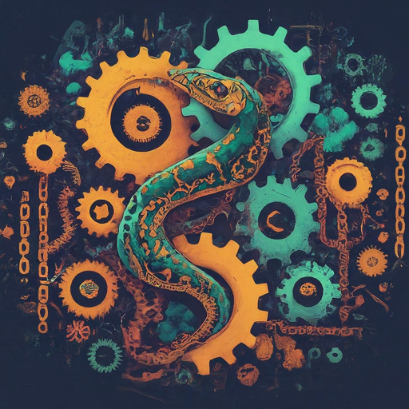

<div align="center">
  <h1>
    <br/>
    
    <br/>
    LangChain Utility
  </h1>
</div>

<p align="center">
  <a href="https://www.python.org/downloads/release/python-3114/">
    
  </a>
  <a href="https://python-poetry.org/">
    
  </a>
  <a href="https://github.com/langchain-ai/langchain">
    
  </a>
  <a href="https://github.com/protectai/llm-guard">
    
  </a>
  <a href="https://github.com/traceloop/openllmetry">
    
  </a>
  <a href="https://github.com/streamlit/streamlit">
    
  </a>
  <a href="https://github.com/qhreul/langchain-util/blob/develop/LICENSE">
    
  </a>
</p>

- [Description](#description)
- [Documentation](#documentation)
- [Development](#development)
  - [Requirements](#requirements)
  - [Environment Variables](#environment-variables)
  - [How to prepare the environment](#how-to-prepare-the-environment) 
- [About RQle.AI](#about-rqle-ai)
- [Disclaimer](#disclaimer)

## Description <a name="description"></a>
[LangChain](https://www.langchain.com/langchain) is a framework for developing applications powered by language models. 
It enables application that:
* **Are context aware**; i.e. connect a language model to sources context
* **Reason**; i.e. rely on a language model to reason

This library offers integration with the following Generative AI servers:
* [AWS Bedrock](https://us-west-2.console.aws.amazon.com/bedrock/home)
* [Azure OpenAI](https://azure.microsoft.com/en-us/products/ai-services/openai-service)
* [Google AI Studio](https://aistudio.google.com/)
* [ollama](https://ollama.com/) 
* [Oracle Cloud Infrastructure AI](https://www.oracle.com/artificial-intelligence/ai-services/)

This library extends LangChain by providing facilities to define configurations, templates for execution of LLMs.

## Documentation <a name="documentation"></a>
To get started refer to the [documentation](docs/get_started/introduction.md).

## Development <a name="development"></a>

### Requirements <a name="requirements"></a>
* Git
* llm-guard >= 0.3
* langchain >= 0.2
* traceloop-sdk >= 0.13
* Python = 3.11 
* Poetry >= 1.7.0
* streamlit >= 1.32


### Environment Variables <a name="environment-variables"></a>
| **Name**                 | **Description**                                                                | **Default**     |
|--------------------------|--------------------------------------------------------------------------------|-----------------|
| `LOG_DIR`                | Location of the logging files                                                  | logs/           |
| `LOG_LEVEL`              | Logging level to be applied during execution                                   | INFO            |
| `AUDIO_TMP_FOLDER`       | Location of temporary audio files when transcribing videos                     | tmp/audio/      |
| `PROMPT_CONFIG_FOLDER`   | Location of the Prompt configuration for execution                             | prompt_configs/ |

### How to prepare the environment <a name="how-to-prepare-the-environment"></a>
* Install dependencies
  ```
  poetry install
  ```
  ---
  **NOTE**
  To update dependencies, it may be needed to run the following command prior to installing the packages:
  ```
  poetry lock
  ```
  ---
* Test unit test coverage for the project
  ```
  poetry run coverage run -m pytest && poetry run coverage report -m
  ```
  **Note** Report is only generated if all unit test have completed successfully.

## About RQle.AI <a name="about-rqle-ai"></a>
[**RQle.AI**](https://www.linkedin.com/company/102641077) believes in the transformative potential of Generative AI. More specifically, it focuses on showcasing real-world applications of how Generative AI can empower individuals and organizations worldwide in addressing customers' "*job to be done*" problems and create value for them.

## Disclaimer <a name="disclaimer"></a>
This library and its use of Large Language Models (LLMs) are subject to the **following disclaimers**:
* LLMs are still under development and may generate inaccurate, incomplete, or biased output;
* LLMs can inherit and reflect biases present in their training data;
* Developers of this library are not liable for any damages or losses arising from its use;
* You are responsible for using the library and LLMs in an ethical and responsible manner.

**By using this library, you acknowledge and agree to these disclaimers and limitations**.

<div style="text-align: center;">
  <hr/>
  
  &nbsp; RQle.AI - 2024
</div>