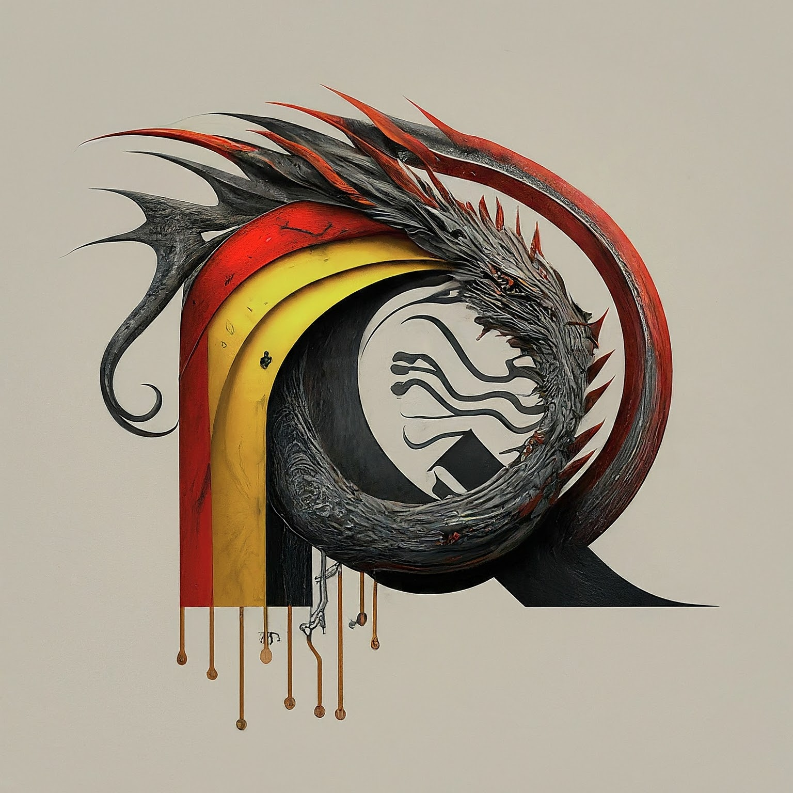

<div align="center">
  <h1>
    <br/>
    
    <br/>
    ClarityGenie
  </h1>
</div>

- [Description](#description)
- [Run ClarityGenie User Interface](#claritygenieui)
- [About RQle AI](#about-rqle-ai)
- [Related Materials](#related-material)
- [Disclaimer](#disclaimer)

## Description <a name="description"></a>
Prompt Engineering

## Run ClarityGenie User Interface <a name="claritygenieui"></a>
To start the User Interface (UI) for ClarityGenie, the following command should be executed
```
 streamlit run .\rqle_ai_langchain_util\guis\clarity_genie_ui.py
```

## About RQle AI <a name="about-rqle-ai"></a>
**RQle AI** believes in the transformative potential of Generative AI. More specifically, it focuses on showcasing real-world applications of how Generative AI can empower individuals and organizations worldwide in addressing customers' "*job to be done*" problems and create value for them.

## Related Materials <a name="related-material"></a>

## Disclaimer <a name="disclaimer"></a>
This application was partially generated by a large language model (Generative AI). While the AI assisted in the 
generation of ideas and content, the final solution and its implementation remain the responsibility of the human user. 
It is important to critically evaluate and revise the AI-generated content to ensure its accuracy, appropriateness, 
and ethical implications.

<div style="text-align: center;" markdown="1">
  <hr/>
  
  &nbsp; RQle AI&#169; - 2024
</div>