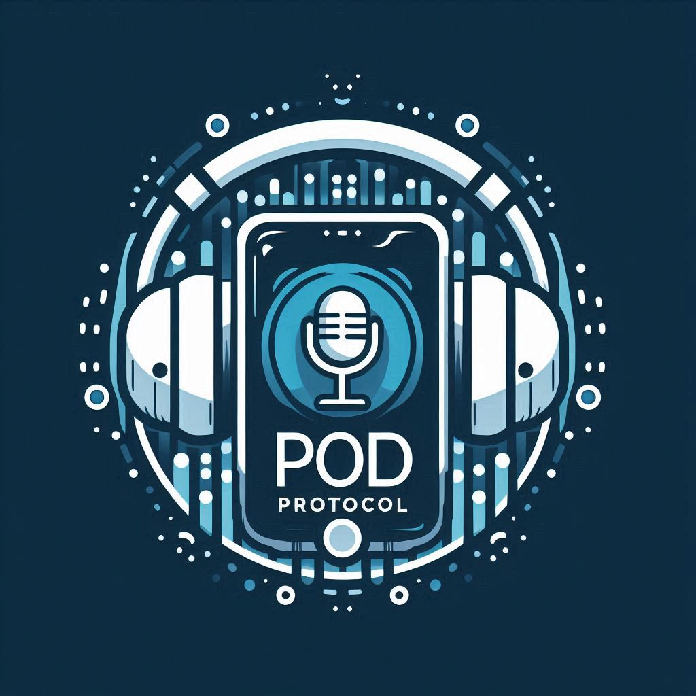

  <h1>
     
    
     
    Pod Protocol
  </h1>

- [Description](#description)
- [Run Pod Protocol](#pod-protocol)
- [Known Limitations](#known-limitations)
- [Related Materials](#related-material)
- [About RQle.AI](#about-rqle-ai)
- [Disclaimer](#disclaimer)

## Description 
**Pod Protocol** is the ultimate tool for podcasters ready to expand their reach and maximize their content's impact. 
Say goodbye to the tedious task of manually transcribing your episodes and hello to automated content repurposing!

Here's how Pod Protocol takes your podcast further:
* **Effortless Transcription**: Our advanced AI technology accurately transcribes your video podcasts, capturing every 
insightful word and witty remark.
* **Automated Blog Post Creation**: Pod Protocol transforms your transcripts into engaging blog posts.
* **Boost SEO & Discoverability**: Increase your online visibility with optimized blog content that search engines love.

Pod Protocol is perfect for:
* Podcasters looking to grow their audience and expand their platform.
* Content creators seeking to repurpose their audio and video content.
* Businesses and brands wanting to share their expertise and engage with customers.

Stop letting your valuable podcast content go unheard. Try Pod Protocol today and unlock the full potential of your 
audio and video content!

## Run Pod Protocol 

## Known Limitations 

## Related Materials 
https://realpython.com/python-speech-recognition/
## About RQle.AI 
[**RQle.AI**](https://www.linkedin.com/company/102641077) believes in the transformative potential of Generative AI. More specifically, it focuses on 
showcasing real-world applications of how Generative AI can empower individuals and organizations worldwide in addressing 
customers' "*job to be done*" problems and create value for them.

## Disclaimer 
This application was partially generated by a large language model (Generative AI). While the AI assisted in the 
generation of ideas and content, the final solution and its implementation remain the responsibility of the human user. 
It is important to critically evaluate and revise the AI-generated content to ensure its accuracy, appropriateness, 
and ethical implications.

  

  
  &nbsp; RQle.AI - 2024

